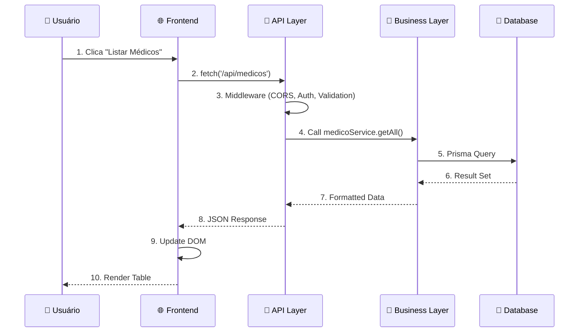
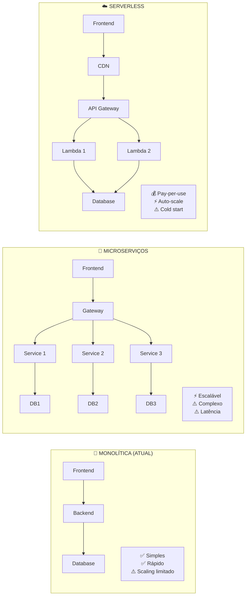

```mermaid
graph TB
    subgraph "🏥 MediApp - Arquitetura Atual"
        subgraph "🌐 PRESENTATION LAYER"
            A[📱 Web Interface<br/>HTML5/CSS3/JavaScript] 
            A --> A1[gestao-medicos.html]
            A --> A2[gestao-pacientes.html] 
            A --> A3[prontuarios.html]
            A --> A4[analytics-mapas.html]
            
            B[📱 Mobile App<br/>React Native]
            B --> B1[src/screens/]
            B --> B2[src/components/]
            B --> B3[src/services/api.ts]
        end
        
        subgraph "🔗 API LAYER"
            C[🛡️ Express.js Server<br/>PORT: 3001/3002]
            C --> C1[robust-server.js<br/>Produção Estável]
            C --> C2[src/server.js<br/>Desenvolvimento]
            C --> C3[real-data-server.js<br/>Dados Reais]
            
            D[📋 API Routes]
            D --> D1[/api/medicos/*<br/>CRUD Médicos]
            D --> D2[/api/pacientes/*<br/>CRUD Pacientes]
            D --> D3[/api/records/*<br/>Prontuários]
            D --> D4[/api/exams/*<br/>Exames]
            D --> D5[/api/auth/*<br/>Autenticação]
            D --> D6[/api/analytics/*<br/>Dashboard]
        end
        
        subgraph "🧠 BUSINESS LAYER"
            E[🔧 Prisma ORM + Business Logic]
            E --> E1[src/services/<br/>Lógica de Negócio]
            E --> E2[src/middleware/<br/>Validações]
            E --> E3[src/utils/<br/>Utilitários]
            E --> E4[prisma/schema.prisma<br/>Modelo de Dados]
        end
        
        subgraph "💾 DATA LAYER"
            F[🗄️ PostgreSQL Database<br/>PORT: 5432]
            F --> F1[Tables: usuarios, medicos,<br/>pacientes, prontuarios, exames]
            F --> F2[Constraints & Indexes]
            F --> F3[Stored Procedures & Views]
        end
    end
    
    %% Connections
    A -.->|fetch('/api/medicos')| C
    B -.->|axios.get('/api/patients')| C
    C -->|Express Routes| D
    D -->|Business Logic| E
    E -->|Prisma ORM| F
    
    %% External Services
    G[🌐 ViaCEP API<br/>Endereços]
    H[📊 IBGE API<br/>Dados Geográficos]
    
    D6 -.->|HTTP Requests| G
    D6 -.->|HTTP Requests| H
    
    %% Styling
    classDef frontend fill:#e1f5fe,stroke:#0277bd,stroke-width:2px
    classDef backend fill:#f3e5f5,stroke:#7b1fa2,stroke-width:2px
    classDef database fill:#e8f5e8,stroke:#388e3c,stroke-width:2px
    classDef external fill:#fff3e0,stroke:#f57c00,stroke-width:2px
    
    class A,A1,A2,A3,A4,B,B1,B2,B3 frontend
    class C,C1,C2,C3,D,D1,D2,D3,D4,D5,D6,E,E1,E2,E3,E4 backend
    class F,F1,F2,F3 database
    class G,H external
```

## 🔄 **FLUXO DE COMUNICAÇÃO ATUAL**



## 📊 **COMPARAÇÃO DE ARQUITETURAS**

