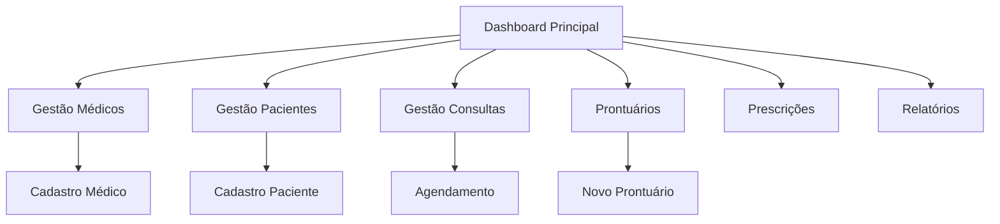

# 🏥 MediApp - Dashboard Principal

## 📋 Visão Geral

A página `app.html` é o **hub central** do MediApp, servindo como ponto de entrada principal para todas as funcionalidades do sistema. Foi redesenhada com uma arquitetura modular e interface intuitiva baseada em cards de features.

## 🎯 Estrutura da Página Principal

### 📊 Seção de Estatísticas
```html
<!-- Stats Cards Row -->
<div class="grid grid-cols-4 mb-8">
  - Total de Médicos
  - Total de Pacientes  
  - Consultas Hoje
  - Consultas na Semana
</div>
```

### 🎨 Cards de Features Principais
```html
<!-- Main Features Grid -->
<div class="grid grid-cols-3 gap-6 mb-8">
```

#### 🩺 Gestão de Médicos
- **Ícone**: `fa-user-md` (Azul Primário)
- **Funcionalidade**: Cadastro e gestão de médicos
- **Navegação**: `/gestao-medicos.html`
- **Estatística**: Número total de médicos cadastrados

#### 👥 Gestão de Pacientes  
- **Ícone**: `fa-users` (Verde Sucesso)
- **Funcionalidade**: Cadastro e gestão de pacientes
- **Navegação**: `/gestao-pacientes.html`
- **Estatística**: Número total de pacientes cadastrados

#### 📅 Gestão de Consultas
- **Ícone**: `fa-calendar-alt` (Azul Info)
- **Funcionalidade**: Agendamento e gestão de consultas
- **Navegação**: `/gestao-consultas.html`
- **Estatística**: Consultas agendadas para hoje

#### 📋 Prontuários
- **Ícone**: `fa-file-medical` (Amarelo Warning)
- **Funcionalidade**: Prontuários eletrônicos e anamnese
- **Navegação**: `/prontuarios.html`
- **Estatística**: Prontuários ativos no sistema

#### 💊 Prescrições Médicas
- **Ícone**: `fa-prescription-bottle` (Roxo Purple)
- **Funcionalidade**: Criação de receitas e prescrições
- **Navegação**: `/prescricao-medica.html`
- **Estatística**: Prescrições emitidas

#### 📈 Relatórios
- **Ícone**: `fa-chart-bar` (Cinza Secondary)
- **Funcionalidade**: Relatórios e análises do sistema
- **Navegação**: `/relatorios.html`
- **Estatística**: Relatórios disponíveis (fixo: 12)

### ⚡ Ações Rápidas
```html
<!-- Quick Actions Row -->
<div class="grid grid-cols-4 gap-4">
```
- **Novo Médico**: Acesso direto ao cadastro de médico
- **Novo Paciente**: Acesso direto ao cadastro de paciente  
- **Nova Consulta**: Acesso direto ao agendamento
- **Novo Prontuário**: Acesso direto à criação de prontuário

## 🎨 Sistema de Design

### Paleta de Cores por Feature
- **Médicos**: `--primary-600` (#3182ce) - Azul profissional
- **Pacientes**: `--success-600` (#059669) - Verde cuidado  
- **Consultas**: `--info-600` (#0284c7) - Azul informativo
- **Prontuários**: `--warning-600` (#d97706) - Amarelo atenção
- **Prescrições**: `--purple-600` (#9333ea) - Roxo medicina
- **Relatórios**: `--gray-600` (#4b5563) - Cinza neutro

### Efeitos de Interação
```css
.feature-card:hover {
    transform: translateY(-4px);
    box-shadow: var(--shadow-lg);
    border-color: var(--primary-200);
}
```

## 🔧 Funcionalidades JavaScript

### Sistema de Navegação
```javascript
// Feature card navigation
document.querySelectorAll('.feature-card[data-navigate]').forEach(card => {
    card.addEventListener('click', (e) => {
        this.navigate(card.dataset.navigate);
    });
});
```

### Ações Rápidas com Context
```javascript
// Button navigation with action context
document.querySelectorAll('button[data-navigate]').forEach(btn => {
    btn.addEventListener('click', (e) => {
        const url = btn.dataset.navigate;
        const action = btn.dataset.action;
        
        if (action === 'new') {
            this.navigate(url + '?action=new');
        }
    });
});
```

### Carregamento de Estatísticas em Tempo Real
```javascript
async loadDashboardStats() {
    // Carrega dados do backend
    // Atualiza cards principais e de features
    // Atualização automática a cada 5 minutos
}
```

## 📱 Responsividade

### Desktop (≥1024px)
- Grid 3 colunas para features principais
- Grid 4 colunas para ações rápidas
- Cards com hover effects completos

### Tablet (768px - 1023px)  
- Grid 2 colunas para features principais
- Grid 3 colunas para ações rápidas
- Mantém funcionalidade completa

### Mobile (≤767px)
- Grid 1 coluna para features principais
- Grid 2 colunas para ações rápidas
- Cards otimizados para touch

## 🔄 Fluxo de Navegação



## 🚀 Benefícios da Arquitetura

### 🎯 UX/UI
- **Navegação Intuitiva**: Cards visuais facilitam identificação
- **Feedback Visual**: Hover effects e cores consistentes
- **Acesso Rápido**: Botões de ação direta para tarefas comuns
- **Informações Contextuais**: Estatísticas em tempo real

### 🏗️ Arquitetura  
- **Modular**: Cada feature é um componente independente
- **Escalável**: Fácil adição de novos cards de funcionalidade
- **Consistente**: Design system unificado
- **Performante**: Carregamento otimizado com cache

### 📊 Analytics
- **Métricas Visuais**: Estatísticas em destaque nos cards
- **Tempo Real**: Atualização automática dos dados
- **Contexto Rápido**: Visão geral do sistema em uma tela

## 📈 Próximas Melhorias

1. **Widgets Interativos**: Gráficos nos cards de estatísticas
2. **Customização**: Permitir reordenação dos cards
3. **Notificações**: Badges de alertas nos cards
4. **Shortcuts**: Atalhos de teclado para navegação rápida
5. **Temas**: Suporte a tema claro/escuro

---

**Status**: ✅ Implementado e funcionando
**Compatibilidade**: Desktop, Tablet e Mobile  
**Acessibilidade**: Suporte a navegação por teclado e screen readers